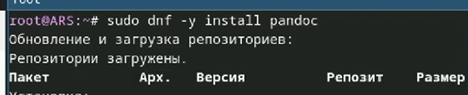

---
## Front matter
title: "Лабораторная работа №1"
subtitle: "Отчет"
author: "Арсакаев Дени"

## Generic otions
lang: ru-RU
toc-title: "Содержание"

## Bibliography
bibliography: bib/cite.bib
csl: pandoc/csl/gost-r-7-0-5-2008-numeric.csl

## Pdf output format
toc: true # Table of contents
toc-depth: 2
lof: true # List of figures
lot: true # List of tables
fontsize: 12pt
linestretch: 1.5
papersize: a4
documentclass: scrreprt
## I18n polyglossia
polyglossia-lang:
  name: russian
  options:
	- spelling=modern
	- babelshorthands=true
polyglossia-otherlangs:
  name: english
## I18n babel
babel-lang: russian
babel-otherlangs: english
## Fonts
mainfont: IBM Plex Serif
romanfont: IBM Plex Serif
sansfont: IBM Plex Sans
monofont: IBM Plex Mono
mathfont: STIX Two Math
mainfontoptions: Ligatures=Common,Ligatures=TeX,Scale=0.94
romanfontoptions: Ligatures=Common,Ligatures=TeX,Scale=0.94
sansfontoptions: Ligatures=Common,Ligatures=TeX,Scale=MatchLowercase,Scale=0.94
monofontoptions: Scale=MatchLowercase,Scale=0.94,FakeStretch=0.9
mathfontoptions:
## Biblatex
biblatex: true
biblio-style: "gost-numeric"
biblatexoptions:
  - parentracker=true
  - backend=biber
  - hyperref=auto
  - language=auto
  - autolang=other*
  - citestyle=gost-numeric
## Pandoc-crossref LaTeX customization
figureTitle: "Рис."
tableTitle: "Таблица"
listingTitle: "Листинг"
lofTitle: "Список иллюстраций"
lotTitle: "Список таблиц"
lolTitle: "Листинги"
## Misc options
indent: true
header-includes:
  - \usepackage{indentfirst}
  - \usepackage{float} # keep figures where there are in the text
  - \floatplacement{figure}{H} # keep figures where there are in the text
---

# Цель работы

Целью данной работы является приобретение практических навыков установки операционной системы на виртуальную машину, настройки минимально необходимых для дальнейшей работы сервисов.  

# Задание

Установка ОС  
Установка системы на диск  
Повышение комфорта работы  
Автоматическое обновление  
Отключение SELinux  
Настройка раскладки клавиатуры  
Установка программного обеспечения для создания документации  

# Выполнение лабораторной работы   

Добавляем iso образ Fedor'ы  
{#fig:001 width=70%}  

Настраиваем пользователя и и выбираем диск  
{#fig:001 width=70%}  
{#fig:001 width=70%}  

Установка средства разработки  
{#fig:001 width=70%}  

Устанавливаю программу для удобства работы в консоли  
{#fig:001 width=70%}   

'+' еще другой вариант консоли  
{#fig:001 width=70%}  

Настраиваю автоматическое обновление  
{#fig:001 width=70%}  
Запускаю таймер  

В файле /etc/selinux/config заменяю значение  

SELINUX=enforcing  
на значение  
SELINUX=permissive  
{#fig:001 width=70%}  

Устанавливаю пакет DKMS  
{#fig:001 width=70%}  

Устанавливаю драйвера  
{#fig:001 width=70%}  

И перезагружаю систему  
{#fig:001 width=70%}  

Настройка раскладки клавиатуры:  
Создаю папку и конф. файл  
{#fig:001 width=70%}  

Редактирую файл с помощью команды nano  
{#fig:001 width=70%}  

Устанавливаю pandoc  
{#fig:001 width=70%}  

Скачиваю pandoc-crossref и распаковываю файл  
{#fig:001 width=70%}  

Перемещаю pandoc-crossref в папку bin  
{#fig:001 width=70%}  

Устанавливаю texlive  
{#fig:001 width=70%}  

Отыеты на вопросы  
{#fig:001 width=70%}  
{#fig:001 width=70%}  

# Выводы

Мы настрили системы для работы.  

::: {#refs}
:::
