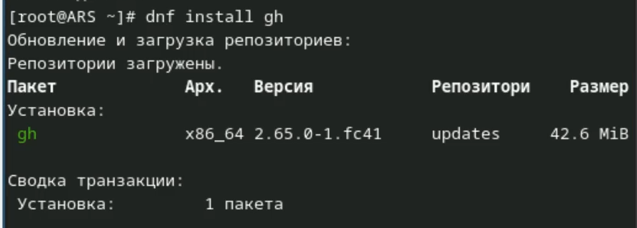
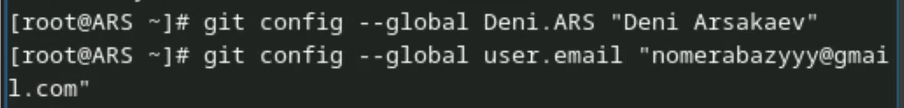
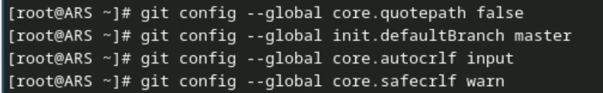
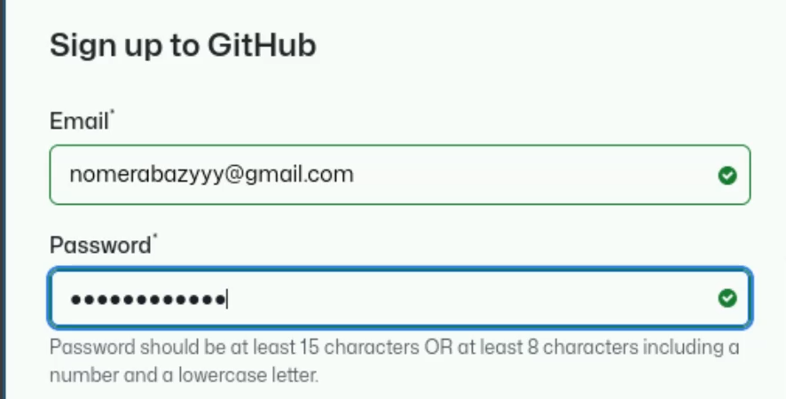
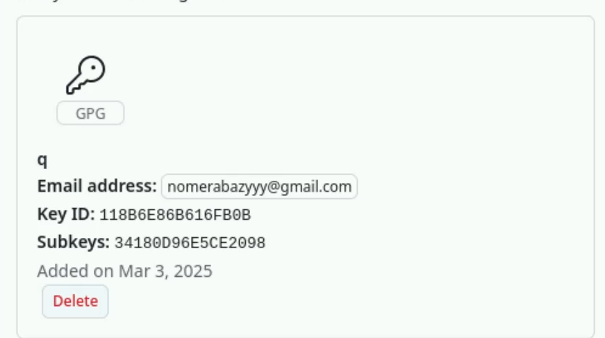
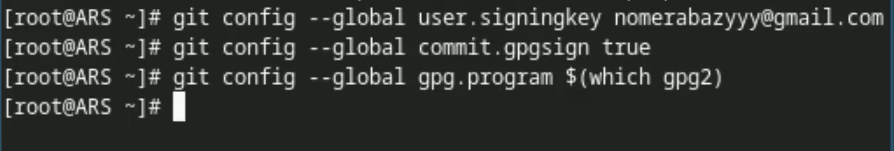

---
## Front matter
title: "Лабораторная работа №2"
subtitle: "Отчет"
author: "Арсакаев Дени Умарович"

## Generic otions
lang: ru-RU
toc-title: "Содержание"

## Bibliography
bibliography: bib/cite.bib
csl: pandoc/csl/gost-r-7-0-5-2008-numeric.csl

## Pdf output format
toc: true # Table of contents
toc-depth: 2
lof: true # List of figures
lot: true # List of tables
fontsize: 12pt
linestretch: 1.5
papersize: a4
documentclass: scrreprt
## I18n polyglossia
polyglossia-lang:
  name: russian
  options:
	- spelling=modern
	- babelshorthands=true
polyglossia-otherlangs:
  name: english
## I18n babel
babel-lang: russian
babel-otherlangs: english
## Fonts
mainfont: IBM Plex Serif
romanfont: IBM Plex Serif
sansfont: IBM Plex Sans
monofont: IBM Plex Mono
mathfont: STIX Two Math
mainfontoptions: Ligatures=Common,Ligatures=TeX,Scale=0.94
romanfontoptions: Ligatures=Common,Ligatures=TeX,Scale=0.94
sansfontoptions: Ligatures=Common,Ligatures=TeX,Scale=MatchLowercase,Scale=0.94
monofontoptions: Scale=MatchLowercase,Scale=0.94,FakeStretch=0.9
mathfontoptions:
## Biblatex
biblatex: true
biblio-style: "gost-numeric"
biblatexoptions:
  - parentracker=true
  - backend=biber
  - hyperref=auto
  - language=auto
  - autolang=other*
  - citestyle=gost-numeric
## Pandoc-crossref LaTeX customization
figureTitle: "Рис."
tableTitle: "Таблица"
listingTitle: "Листинг"
lofTitle: "Список иллюстраций"
lotTitle: "Список таблиц"
lolTitle: "Листинги"
## Misc options
indent: true
header-includes:
  - \usepackage{indentfirst}
  - \usepackage{float} # keep figures where there are in the text
  - \floatplacement{figure}{H} # keep figures where there are in the text
---

# Цель работы

Изучить идеологию и применение средств контроля версий.  
Освоить умения по работе с git.  

# Задание

1.Создать базовую конфигурацию для работы с Git.  
2.Создать ключ SSH.  
3.Создать ключ PGP.  
4.Настроить подписи Git.  
5.Зарегистрироваться на Github.  
6.Создать локальный каталог для выполнения заданий по АКиОС.  

# Выполнение лабораторной работы
установим git и gh   
{#fig:001 width=70%}  
{#fig:001 width=70%}  

Зададим имя и email владельца репозитория:  
{#fig:001 width=70%}  

Зададим имя начальной ветки, параметр autocrlf и safecrlf:  
{#fig:001 width=70%}  

Создайем ключи ssh:  
{#fig:001 width=70%}  

Создайем ключи pgp:  
{#fig:001 width=70%}   

Создаю уч. запись GH:  
{#fig:001 width=70%}  

В настройках GitHub'a добавляю pgp ключ:  
{#fig:001 width=70%}  

Настройка автоматических подписей коммитов git:  
{#fig:001 width=70%}   

Настройка gh:  
{#fig:001 width=70%}  

Cоздаю каталог и cкачиваю туда шаблон для рабочего пространства:  
{#fig:001 width=70%}  
{#fig:001 width=70%}  

Удаляем лишние файлы и создаем каталоги:  
{#fig:001 width=70%}  

Отправляем файлы на сервер:  
{#fig:001 width=70%}  
{#fig:001 width=70%}  

# Выводы

Мы научились пользоваться GitHub!

::: {#refs}
:::
