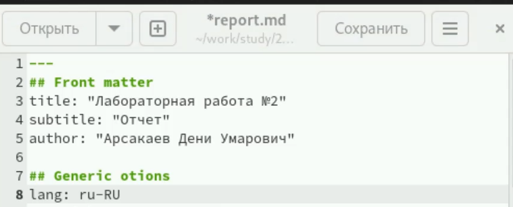
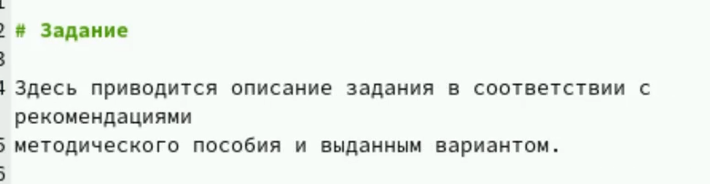
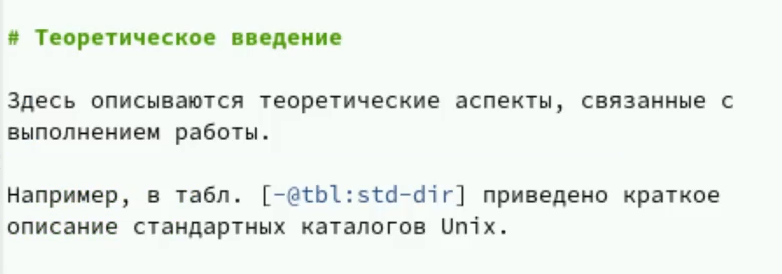
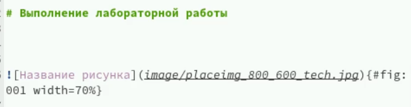
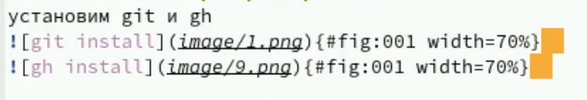
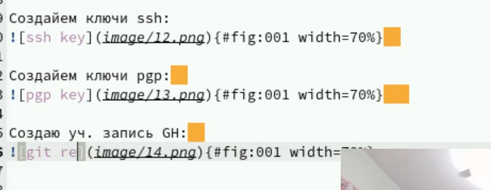
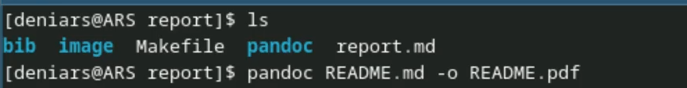

---
## Front matter
title: "Лабораторная работа №3"
subtitle: "Отчет"
author: "Арсакаев Дени"

## Generic otions
lang: ru-RU
toc-title: "Содержание"

## Bibliography
bibliography: bib/cite.bib
csl: pandoc/csl/gost-r-7-0-5-2008-numeric.csl

## Pdf output format
toc: true # Table of contents
toc-depth: 2
lof: true # List of figures
lot: true # List of tables
fontsize: 12pt
linestretch: 1.5
papersize: a4
documentclass: scrreprt
## I18n polyglossia
polyglossia-lang:
  name: russian
  options:
	- spelling=modern
	- babelshorthands=true
polyglossia-otherlangs:
  name: english
## I18n babel
babel-lang: russian
babel-otherlangs: english
## Fonts
mainfont: IBM Plex Serif
romanfont: IBM Plex Serif
sansfont: IBM Plex Sans
monofont: IBM Plex Mono
mathfont: STIX Two Math
mainfontoptions: Ligatures=Common,Ligatures=TeX,Scale=0.94
romanfontoptions: Ligatures=Common,Ligatures=TeX,Scale=0.94
sansfontoptions: Ligatures=Common,Ligatures=TeX,Scale=MatchLowercase,Scale=0.94
monofontoptions: Scale=MatchLowercase,Scale=0.94,FakeStretch=0.9
mathfontoptions:
## Biblatex
biblatex: true
biblio-style: "gost-numeric"
biblatexoptions:
  - parentracker=true
  - backend=biber
  - hyperref=auto
  - language=auto
  - autolang=other*
  - citestyle=gost-numeric
## Pandoc-crossref LaTeX customization
figureTitle: "Рис."
tableTitle: "Таблица"
listingTitle: "Листинг"
lofTitle: "Список иллюстраций"
lotTitle: "Список таблиц"
lolTitle: "Листинги"
## Misc options
indent: true
header-includes:
  - \usepackage{indentfirst}
  - \usepackage{float} # keep figures where there are in the text
  - \floatplacement{figure}{H} # keep figures where there are in the text
---

# Цель работы
Изучение Markdown. Этот язык разметки позволяет легко форматировать текст, что делает процесс написания более удобным. Он обеспечивает хорошую читаемость даже в своем исходном виде, что упрощает работу с документами. Markdown поддерживается на многих платформах, таких как GitHub и Reddit, что делает его универсальным инструментом. Кроме того, его просто конвертировать в HTML и другие форматы, что расширяет его возможности. Для разработчиков Markdown становится незаменимым при написании документации, так как он облегчает совместную работу над проектами. Этот язык разметки позволяет быстро создавать и редактировать тексты без необходимости отвлекаться на сложные инструменты. Сосредоточение на содержании делает процесс написания более эффективным и минималистичным. Изучая Markdown, вы также получаете базовые навыки работы с разметкой, что может быть полезно в будущем. В целом, освоение Markdown значительно повышает продуктивность и упрощает работу с текстом.  

# Задание 

Наша задача это разными спосабами сделать презентацию   

# Выполнение лабораторной работы
Открываю .md файл и начинаю его заполнять  

Первым делом нам нужно заполнить такие поля как title, subtitle и author  
{#fig:001 width=70%}   

Дальше нас встречает строка "Цель работы"  
Тут мы кратко описывает что собираемся делать  
{#fig:001 width=70%}   

Следем идут поля 'Теоретическое введение' и 'Задание'  

Их обычно я пропускаю т.к. наш отчет небольшой и эти поля не имеют особого смысла в нашем случае   
{#fig:001 width=70%} 

{#fig:001 width=70%}   

И самое важно поле над котором мы будем работать это 'Выполнение лабораторной работы'  

Здесь мы прикрепляем фотографии и описываем процесс  
{#fig:001 width=70%}  

Чтобы прикрепить фото мы используем такую конструкцию>   
{#fig:001 width=70%}   
где image - это папка, а после / идет название фото  

Пару примеров см. фото  
{#fig:001 width=70%}  
{#fig:001 width=70%}  
 
 В конце отчеты заполняем поле 'Выводы'  
 
 Теперь нам надо преоброзовать наш файл .md в файлы pdf, docx и html   
 
 Для этого мы используем команду pandoc report.md -o report.pdf   
{#fig:001 width=70%}   

И вот такой результат мы получаем  
{#fig:001 width=70%}  
  

# Выводы

Изучение Markdown открыло новые возможности для форматирования текста, создания документации и ведения заметок. Это простой и эффективный инструмент для работы с текстом в цифровом формате.  

::: {#refs}
:::
