---
## Front matter
title: "Лабораторная работа №4"
subtitle: "Отчет"
author: "Арсакаев Дени"

## Generic otions
lang: ru-RU
toc-title: "Содержание"

## Bibliography
bibliography: bib/cite.bib
csl: pandoc/csl/gost-r-7-0-5-2008-numeric.csl

## Pdf output format
toc: true # Table of contents
toc-depth: 2
lof: true # List of figures
lot: true # List of tables
fontsize: 12pt
linestretch: 1.5
papersize: a4
documentclass: scrreprt
## I18n polyglossia
polyglossia-lang:
  name: russian
  options:
	- spelling=modern
	- babelshorthands=true
polyglossia-otherlangs:
  name: english
## I18n babel
babel-lang: russian
babel-otherlangs: english
## Fonts
mainfont: IBM Plex Serif
romanfont: IBM Plex Serif
sansfont: IBM Plex Sans
monofont: IBM Plex Mono
mathfont: STIX Two Math
mainfontoptions: Ligatures=Common,Ligatures=TeX,Scale=0.94
romanfontoptions: Ligatures=Common,Ligatures=TeX,Scale=0.94
sansfontoptions: Ligatures=Common,Ligatures=TeX,Scale=MatchLowercase,Scale=0.94
monofontoptions: Scale=MatchLowercase,Scale=0.94,FakeStretch=0.9
mathfontoptions:
## Biblatex
biblatex: true
biblio-style: "gost-numeric"
biblatexoptions:
  - parentracker=true
  - backend=biber
  - hyperref=auto
  - language=auto
  - autolang=other*
  - citestyle=gost-numeric
## Pandoc-crossref LaTeX customization
figureTitle: "Рис."
tableTitle: "Таблица"
listingTitle: "Листинг"
lofTitle: "Список иллюстраций"
lotTitle: "Список таблиц"
lolTitle: "Листинги"
## Misc options
indent: true
header-includes:
  - \usepackage{indentfirst}
  - \usepackage{float} # keep figures where there are in the text
  - \floatplacement{figure}{H} # keep figures where there are in the text
---

# Цель работы
Получение навыков правильной работы с репозиториями git.  

# Задание

Выполнить работу для тестового репозитория. Преобразовать рабочий репозиторий в репозитории с git-flow и обычными коммитами.  

# Выполнение лабораторной работы
Установка git-flow  
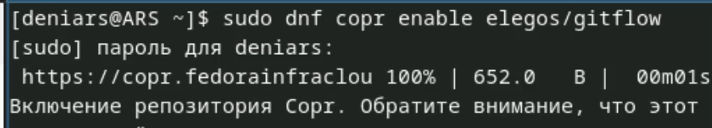{#fig:001 width=70%}  
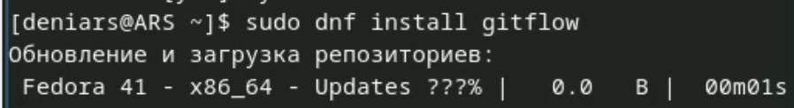{#fig:001 width=70%}  

Установка Node.js  
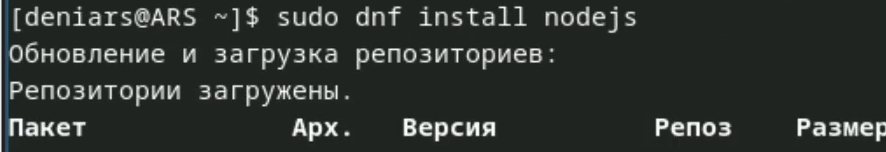{#fig:001 width=70%}  

Устанавливаю pnpm  
 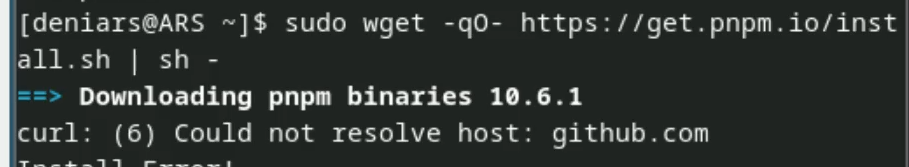{#fig:001 width=70%}  
 
Запускаю pnpm  
{#fig:001 width=70%}  

Выполняю  
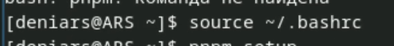{#fig:001 width=70%}  

Данная программа используется для помощи в форматировании коммитов.  
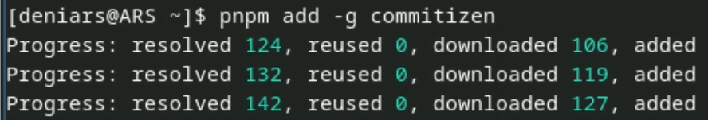{#fig:001 width=70%}  

При этом устанавливается скрипт git-cz, который мы и будем использовать для коммитов.  
Данная программа используется для помощи в создании логов.  
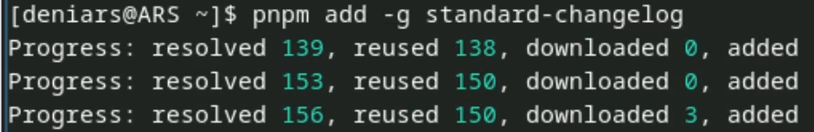{#fig:001 width=70%}  

Создаю репозиторий с название git-extended на GitHub  
И скачиваю себе на Sway  
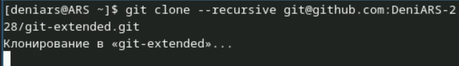{#fig:001 width=70%}  

Делаю первый коммит и выкладываем на github:  
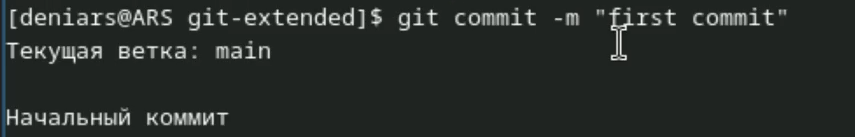{#fig:001 width=70%}  
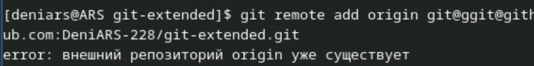{#fig:001 width=70%}  

Конфигурация для пакетов Node.js  
Заполняю несколько параметров  
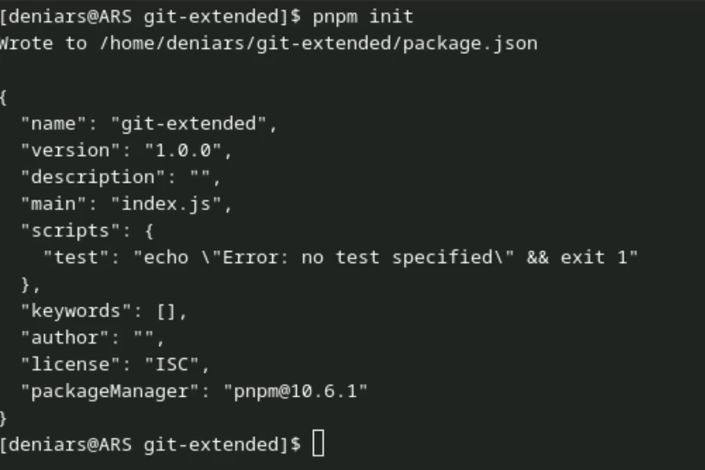{#fig:001 width=70%}   

Получаю такой результат  
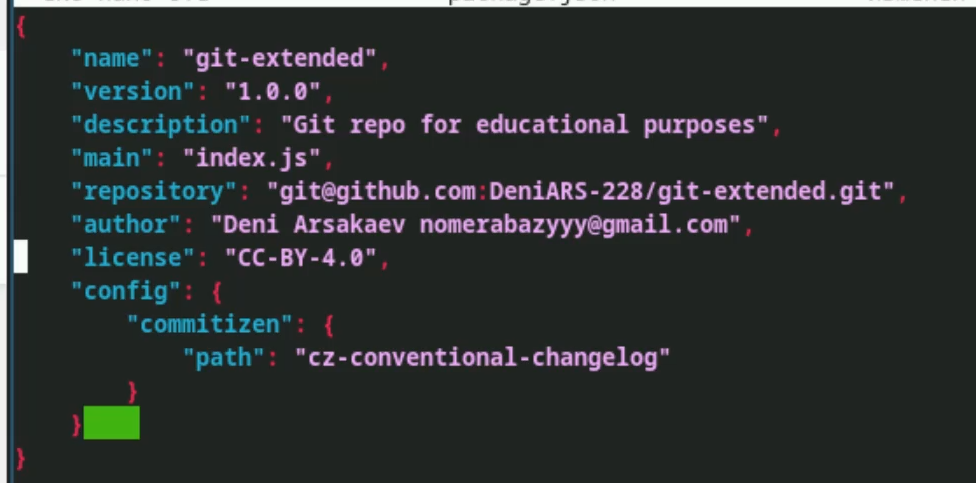{#fig:001 width=70%}  
 
 
Добавляю новые файлы и выполняю коммит:  
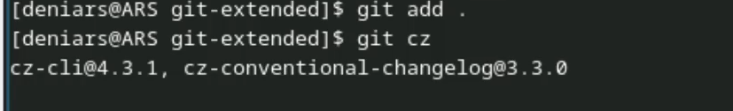{#fig:001 width=70%}  
{#fig:001 width=70%}  

Инициализируем git-flow   
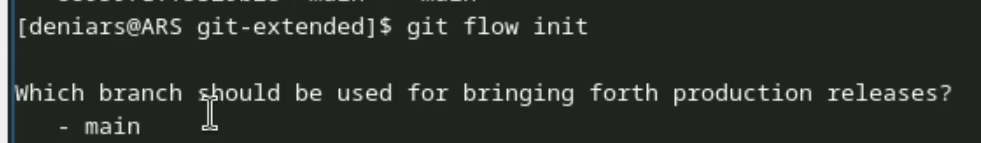{#fig:001 width=70%}  
Префикс для ярлыков устанавливаю в v  

Проверяю, что я на ветке develop:  
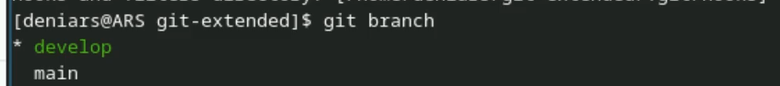{#fig:001 width=70%}  

Загружаю весь репозиторий в хранилище:  
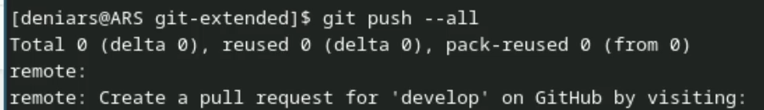{#fig:001 width=70%}  

Устанавливаю внешнюю ветку как вышестоящую для этой ветки и создаю релиз с версией 1.0.0  
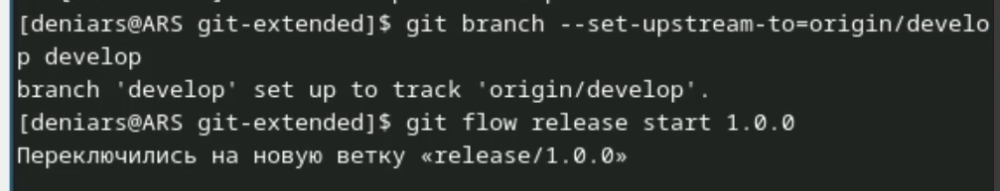{#fig:001 width=70%}  
   
Отправим данные на github  
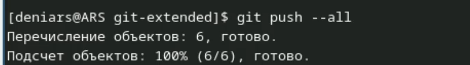{#fig:001 width=70%}  
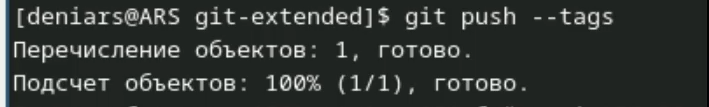{#fig:001 width=70%}  
 
Создаю релиз на github. Для этого буду использовать утилиты работы с github:  
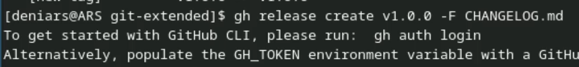{#fig:001 width=70%}  

Создаю релиз с версией 1.2.3:  
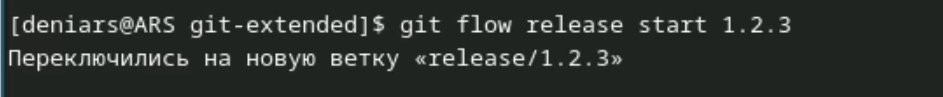{#fig:001 width=70%}  

Обновляю номер версии в файле package.json и получаю такой результат  
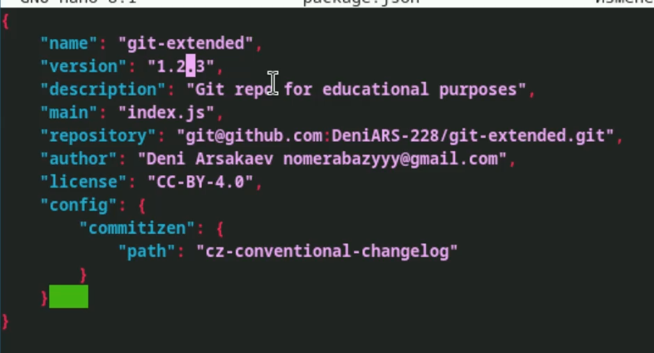{#fig:001 width=70%}  

Добавляю журнал изменений в индекс  
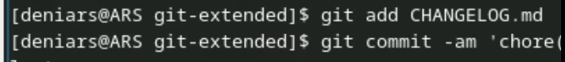{#fig:001 width=70%}  

Отправляю данные на github   
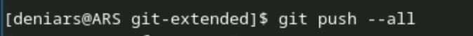{#fig:001 width=70%}  
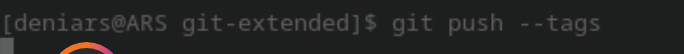{#fig:001 width=70%}  

Создаю релиз на github с комментарием из журнала изменений с помощью коианды gh release create v1.2.3 -F CHANGELOG.md  

# Выводы

Мы получили навыки работы с репозиториями git

::: {#refs}
:::
