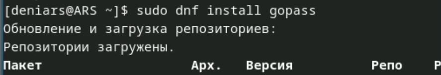
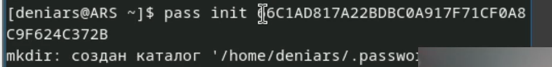
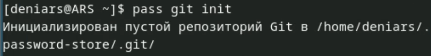
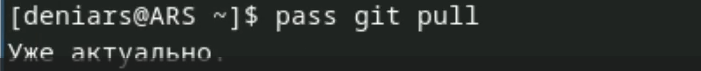
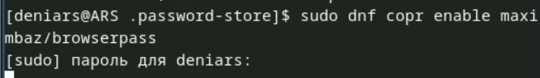
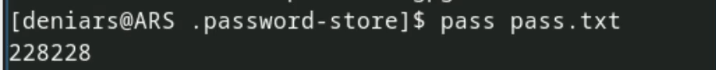
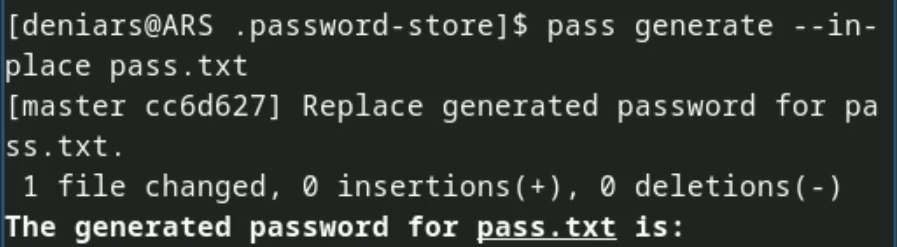
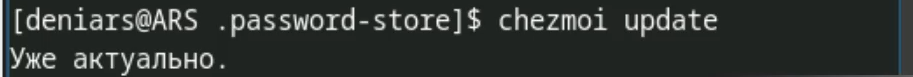
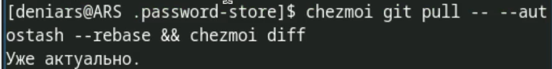
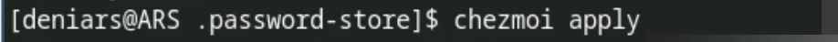

---
## Front matter
title: "Лабораторная работа №5"
subtitle: "Отчет"
author: "Арсакаев Дени"

## Generic otions
lang: ru-RU
toc-title: "Содержание"

## Bibliography
bibliography: bib/cite.bib
csl: pandoc/csl/gost-r-7-0-5-2008-numeric.csl

## Pdf output format
toc: true # Table of contents
toc-depth: 2
lof: true # List of figures
lot: true # List of tables
fontsize: 12pt
linestretch: 1.5
papersize: a4
documentclass: scrreprt
## I18n polyglossia
polyglossia-lang:
  name: russian
  options:
	- spelling=modern
	- babelshorthands=true
polyglossia-otherlangs:
  name: english
## I18n babel
babel-lang: russian
babel-otherlangs: english
## Fonts
mainfont: IBM Plex Serif
romanfont: IBM Plex Serif
sansfont: IBM Plex Sans
monofont: IBM Plex Mono
mathfont: STIX Two Math
mainfontoptions: Ligatures=Common,Ligatures=TeX,Scale=0.94
romanfontoptions: Ligatures=Common,Ligatures=TeX,Scale=0.94
sansfontoptions: Ligatures=Common,Ligatures=TeX,Scale=MatchLowercase,Scale=0.94
monofontoptions: Scale=MatchLowercase,Scale=0.94,FakeStretch=0.9
mathfontoptions:
## Biblatex
biblatex: true
biblio-style: "gost-numeric"
biblatexoptions:
  - parentracker=true
  - backend=biber
  - hyperref=auto
  - language=auto
  - autolang=other*
  - citestyle=gost-numeric
## Pandoc-crossref LaTeX customization
figureTitle: "Рис."
tableTitle: "Таблица"
listingTitle: "Листинг"
lofTitle: "Список иллюстраций"
lotTitle: "Список таблиц"
lolTitle: "Листинги"
## Misc options
indent: true
header-includes:
  - \usepackage{indentfirst}
  - \usepackage{float} # keep figures where there are in the text
  - \floatplacement{figure}{H} # keep figures where there are in the text
---

# Цель работы

Менеджер паролей pass — программа, созданная в рамках идеологии Unix. Также носит название стандартного менеджера паролей для Unix (Стандартный менеджер паролей Unix).  

# Выполнение лабораторной работы
Установим менеджер паролей pass   
{#fig:001 width=70%}  
{#fig:001 width=70%}  

Выводим список gpg ключей  
{#fig:001 width=70%}  

И инициализируем хранилище   
{#fig:001 width=70%}  

Синхранизируем с git  
{#fig:001 width=70%}  

Задаем адрес репозитория на хосте  
{#fig:001 width=70%}   

Для синхронизации выполняем  
{#fig:001 width=70%}   

Создаем каталог  
{#fig:001 width=70%}  

И прописываем следующие команды  
{#fig:001 width=70%}  

Для проверки статуса синхронизации используем  
{#fig:001 width=70%}  

Настройка интерфейса с броузером  
{#fig:001 width=70%}   
{#fig:001 width=70%}   

Создаю тхт файл  
{#fig:001 width=70%}   

Сохраняю пароль  
{#fig:001 width=70%}   
{#fig:001 width=70%}   

Заменяю пароль  
{#fig:001 width=70%}   

Скачиваю доп. программное обеспечение  
{#fig:001 width=70%}   

Уснановка шрифтов   
{#fig:001 width=70%}   

Создаю свой репозиторий  
{#fig:001 width=70%}   

Подключаю свой репозиторий к системе   
{#fig:001 width=70%}   

Указываю свое email  
{#fig:001 width=70%}   

Извлекаю изменения из репозитория  
{#fig:001 width=70%}  
{#fig:001 width=70%}  
{#fig:001 width=70%}  
 
Автоматическое обновление  
{#fig:001 width=70%}

# Выводы

Мы научились работать с менеджером паролей pass

:::
