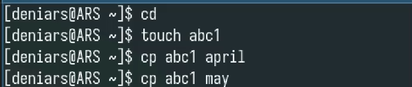
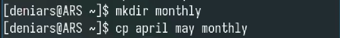
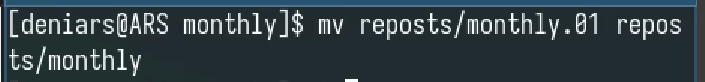
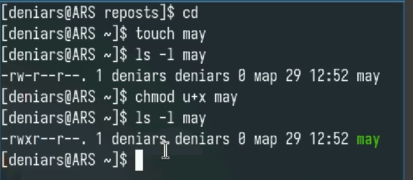
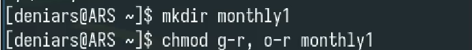
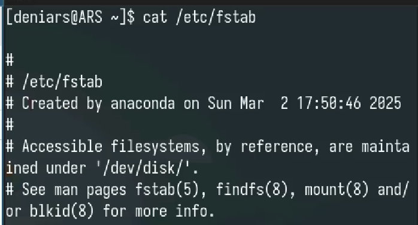

---
## Front matter
title: "Лабораторная работа №7"
subtitle: "Отчет"
author: "Арсакаев Дени"

## Generic otions
lang: ru-RU
toc-title: "Содержание"

## Bibliography
bibliography: bib/cite.bib
csl: pandoc/csl/gost-r-7-0-5-2008-numeric.csl

## Pdf output format
toc: true # Table of contents
toc-depth: 2
lof: true # List of figures
lot: true # List of tables
fontsize: 12pt
linestretch: 1.5
papersize: a4
documentclass: scrreprt
## I18n polyglossia
polyglossia-lang:
  name: russian
  options:
	- spelling=modern
	- babelshorthands=true
polyglossia-otherlangs:
  name: english
## I18n babel
babel-lang: russian
babel-otherlangs: english
## Fonts
mainfont: IBM Plex Serif
romanfont: IBM Plex Serif
sansfont: IBM Plex Sans
monofont: IBM Plex Mono
mathfont: STIX Two Math
mainfontoptions: Ligatures=Common,Ligatures=TeX,Scale=0.94
romanfontoptions: Ligatures=Common,Ligatures=TeX,Scale=0.94
sansfontoptions: Ligatures=Common,Ligatures=TeX,Scale=MatchLowercase,Scale=0.94
monofontoptions: Scale=MatchLowercase,Scale=0.94,FakeStretch=0.9
mathfontoptions:
## Biblatex
biblatex: true
biblio-style: "gost-numeric"
biblatexoptions:
  - parentracker=true
  - backend=biber
  - hyperref=auto
  - language=auto
  - autolang=other*
  - citestyle=gost-numeric
## Pandoc-crossref LaTeX customization
figureTitle: "Рис."
tableTitle: "Таблица"
listingTitle: "Листинг"
lofTitle: "Список иллюстраций"
lotTitle: "Список таблиц"
lolTitle: "Листинги"
## Misc options
indent: true
header-includes:
  - \usepackage{indentfirst}
  - \usepackage{float} # keep figures where there are in the text
  - \floatplacement{figure}{H} # keep figures where there are in the text
---

# Цель работы  
Ознакомление с файловой системой Linux, её структурой, именами и содержанием
каталогов. Приобретение практических навыков по применению команд для работы
с файлами и каталогами, по управлению процессами (и работами), по проверке исполь-
зования диска и обслуживанию файловой системы.  

# Выполнение лабораторной работы

Создаем файл и делаем его копии  
{#fig:001 width=70%}  

Создаем каталог и копируем туда файлы  
{#fig:001 width=70%}  

Копируем файл с другим именем  
{#fig:001 width=70%}  

Создаем каталог и покупируем туда файлы из другой папки рекурсивно  
{#fig:001 width=70%}  

Переименовываем файл  
{#fig:001 width=70%}  

Перемещаем файл в каталог и смотрим его содержимое  
{#fig:001 width=70%}  
{#fig:001 width=70%}  

Создаем папку reposts и перемещаем туда содержимое monthly.01  
{#fig:001 width=70%}  

Перемещаем содержимое monthly.01 в monthly  
{#fig:001 width=70%}  

Cоздаем файл may и даем ему новый права доступа  
{#fig:001 width=70%}  

А теперь забираем  
{#fig:001 width=70%}  

Создаем каталог и забираем права доступа(Просмотр и копирование)   
{#fig:001 width=70%}  

Проверяем какие права присутсвуют  
{#fig:001 width=70%}  

Создаем файл и даем права пользователям на изменение и переименование  
{#fig:001 width=70%}  

Анализ файловой системы с помощью mount и cat  
{#fig:001 width=70%}  
{#fig:001 width=70%}  

# Выводы
Я научился лучше пользоваться unix системой  

:::

