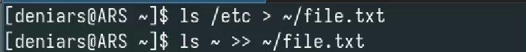
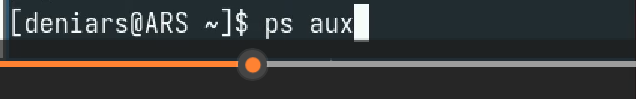
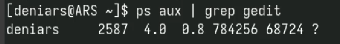
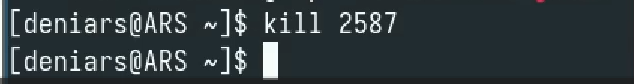
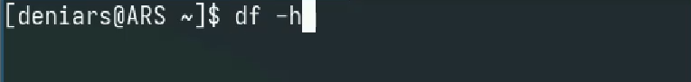
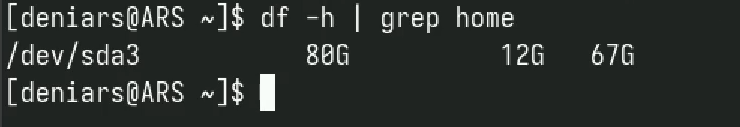
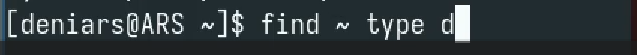
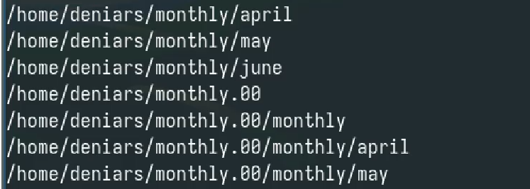

---
## Front matter
title: "Арсакаев Дени"
subtitle: "Отчет"
author: "Арсакаев Дени"

## Generic otions
lang: ru-RU
toc-title: "Содержание"

## Bibliography
bibliography: bib/cite.bib
csl: pandoc/csl/gost-r-7-0-5-2008-numeric.csl

## Pdf output format
toc: true # Table of contents
toc-depth: 2
lof: true # List of figures
lot: true # List of tables
fontsize: 12pt
linestretch: 1.5
papersize: a4
documentclass: scrreprt
## I18n polyglossia
polyglossia-lang:
  name: russian
  options:
	- spelling=modern
	- babelshorthands=true
polyglossia-otherlangs:
  name: english
## I18n babel
babel-lang: russian
babel-otherlangs: english
## Fonts
mainfont: IBM Plex Serif
romanfont: IBM Plex Serif
sansfont: IBM Plex Sans
monofont: IBM Plex Mono
mathfont: STIX Two Math
mainfontoptions: Ligatures=Common,Ligatures=TeX,Scale=0.94
romanfontoptions: Ligatures=Common,Ligatures=TeX,Scale=0.94
sansfontoptions: Ligatures=Common,Ligatures=TeX,Scale=MatchLowercase,Scale=0.94
monofontoptions: Scale=MatchLowercase,Scale=0.94,FakeStretch=0.9
mathfontoptions:
## Biblatex
biblatex: true
biblio-style: "gost-numeric"
biblatexoptions:
  - parentracker=true
  - backend=biber
  - hyperref=auto
  - language=auto
  - autolang=other*
  - citestyle=gost-numeric
## Pandoc-crossref LaTeX customization
figureTitle: "Рис."
tableTitle: "Таблица"
listingTitle: "Листинг"
lofTitle: "Список иллюстраций"
lotTitle: "Список таблиц"
lolTitle: "Листинги"
## Misc options
indent: true
header-includes:
  - \usepackage{indentfirst}
  - \usepackage{float} # keep figures where there are in the text
  - \floatplacement{figure}{H} # keep figures where there are in the text
---

# Цель работы
   
Ознакомление с инструментами поиска файлов и фильтрации текстовых данных. Приобретение практических навыков: по управлению процессами (и заданиями), по проверке использования диска и обслуживанию файловых систем.  
  
   
# Выполнение лабораторной работы
   
Записываю в file.txt названия файлов, содержащихся в каталоге etc  
{#fig:001 width=70%}  
   
Из file.txt все файлы .conf и записываем их conf.txt  
{#fig:001 width=70%}  
  
Файлы, которые начинаются на с из домашнего каталога  
{#fig:001 width=70%}  
   
Вывожу файлы, которые на начинаются на h из /etc  
{#fig:001 width=70%}  
    
Запускаю в фоновом режиме процесс, который будет записывать в файл ~/logfile
файлы, имена которых начинаются с log.  
{#fig:001 width=70%}  
   
Удалите файл ~/logfile.  
{#fig:001 width=70%}   
   
Запускаю из консоли в фоновом режиме редактор gedit.  
{#fig:001 width=70%}   
    
Определите идентификатор процесса gedit  
{#fig:001 width=70%}  
{#fig:001 width=70%}  
   
С помощью kill убиваю процесс gedit  
{#fig:001 width=70%}   
    
С помощью df и du изучаю диск  
{#fig:001 width=70%}  
{#fig:001 width=70%}  
{#fig:001 width=70%}  
  
Вывожу все каталоги из всей системы  
{#fig:001 width=70%}  
{#fig:001 width=70%}  

# Выводы
Мы научились лучше использовать unix системы.  
